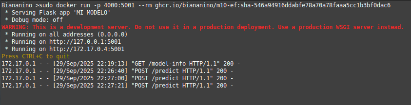
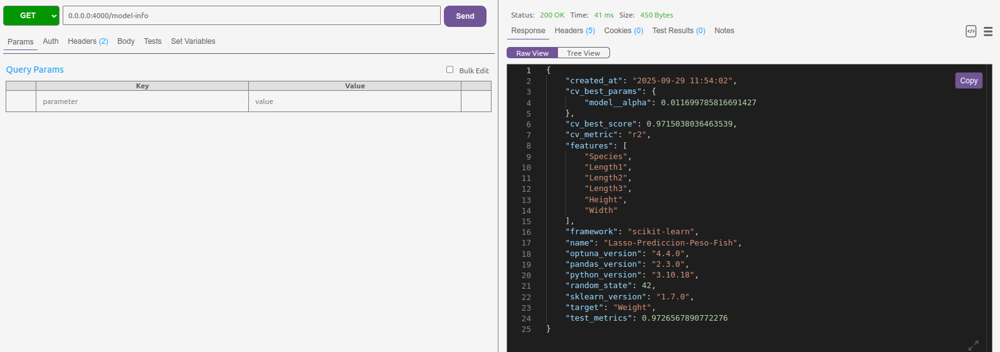
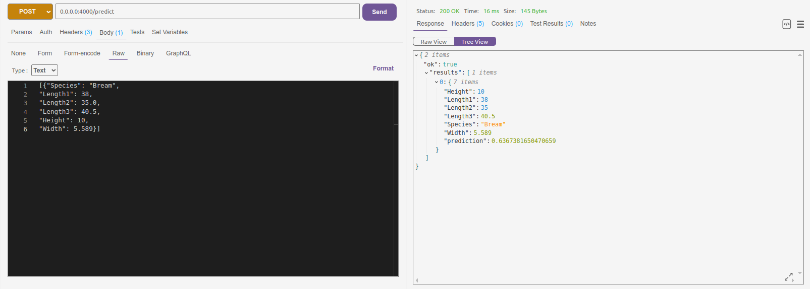

# Predicción de pesos de peces

Todos los pescadores alguna vez han tenido el problema de tener huincha para medir los peces, pero no balanza. Este proyecto es un prototipo de una posible solución.

Este repositorio permite entrenar un modelo de regresión avanzado para **predecir el peso de los peces a partir de medidas anatomicas**, y permite servirlo en una API REST. De este modo todos los pescadores del mundo pueden disfrutar de tan increible innovación.

## Instalación:

### Opción 1:
Instalar la imagen de docker y mapear algun puerto al puerto 5001. Por ejemplo:

```bash
sudo docker run -d -p 4000:5001 ghcr.io/erdelgado-2/pesador-peces
```
monta el servidor en el puerto 4000.



### Opción 2:
Clonar este repositorio y ejecutar 

```bash
python src/app.py
```
El servidor quedara montado en el puerto 5001.

## Usar el servidor:

La información del modelo se puede leer en el path /model-info usando método GET.

```bash
GET 0.0.0.0:4000/model-info
```



Para realizar predicciones se debe utilizar el método POST en el path /predict, y entregar una array de json con las siguientes claves:
Species, Length1, Length2, Length3, Height, Width.

```bash
POST 0.0.0.0:4000/predict
```
Por ejemplo con el siguiente payload:

```bash
[{"Species": "Bream","Length1": 38,"Length2": 35.0,"Length3": 40.5,"Height": 10,"Width": 5.589}]
```

El servidor arroja los diccionarios de vuelta con el campo 'prediccion', que contiene la predicción realizada por el modelo.



