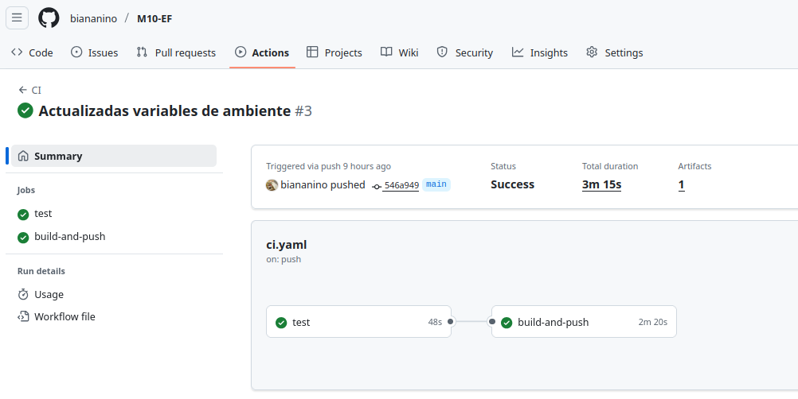

# Predicción de pesos de peces

Realizado para la evaluación final del modulo 10.

Este repositorio entrena un modelo simple de regresión para predecir el peso de los peces a partir de medidas anatomicas, y permite servirlo en una API REST.

## Instalación:

Instalar la imagen de docker y mapear algun puerto al puerto 5001. Por ejemplo:

```bash
sudo docker run -p 4000:5001
```
monta el servidor en el puerto 4000.


## Usar el servidor:

La información del modelo se puede leer en el path /model-info


Para realizar predicciones se debe pasar una lista de diccionarios con las siguientes claves:
Species, Length1, Length2, Length3, Height, Width


## CI/CD:

El repositorio incluye integración continua básica usando GitHub Actions. 



